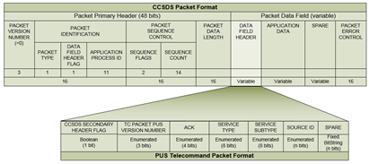
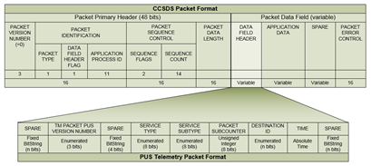

<div style="text-align: center;">
    
</div>

# CCSDSPack


C++ Library for CCSDS Space Packet manipulation. i.e. generation, extraction, analisys and more


### Table of Contents
 - [Description](#Description)
 - [Features](#Features)
 - [Install](#Install)
 - [Examples](#Examples)

## Description
Detailed Documentation: [CCSDSPack Documentation](docs/README.md) 

This section is used to describe how the CCSDS packet is composed and how it can be used.
A simple description of the provided feature:


Where Assuming the Packet identifier data is known, the Package manager is able to: 
* Read / Write a binary file and extract CCSDS Packets.
* Read / Write CCSDS Packets to serial tty, socat...
* Wrap / Extract Data in CCSDS packets.
* Wrap / Extract Real time CCSDS packets.

### The CCSDS Packet protocol
The CCSDS packet is described by:


NOTE: These Images are to be replaced as the source is not attendible and not clear.
### PUS TC (PUS-A) inclusion
This section shows how a PUS-A Packet can be inluded in the CCSDS packet




### PUS TM (PUS-B) inclusion
This section shows how a PUS-B Packet can be inluded in the CCSDS packet




###  PUS-C inclusion
A more flexible and variable sized standard.

### Other Documents
Please check out the documentation on [ccsds documentation](https://public.ccsds.org/Publications/default.aspx). Reccomended documents are within the Blue books.

Also take a look of the following documents:

* [CCSDS 133.0-B-2](https://public.ccsds.org/Pubs/133x0b2e2.pdf) - Space Packet Protocol
* [CCSDS 133.1-B-3](https://public.ccsds.org/Pubs/133x1b3e1.pdf) - Encapsulation Packet Protocol
* [CCSDS 524.1-B-1](https://public.ccsds.org/Pubs/524x1b1.pdf) - Mission Operations--MAL Space Packet Transport Binding and Binary Encoding


## Features
1) User-friendly installation and usage within your code.
2) Optimised for fast execution.
3) CRC16, Checksum tests for easy retransmission on faulty packet.
4) Reed-Solomon Error correction on data (optional).
5) Integrated serial connection and transmission with ACK and NACK packets.
```
                |                   |     
                | ----- CCSDS ----> |     
          TX    |                   |    RX    
                | <----- ACK ------ |     
                |                   |     
```
6) Included binaries to transmit files trough a serial connection using CCSDS packages.

## Install
1) Source - use the cmake and make commands to compile the whole project and install it.
2) RPM    - Use the precompiled rpm installers and linux commands to extract and install.
3) Docker - Installation within a Docker container, use the provided bash script under the "docker" directory.

## Examples
1) This example shows how this library can be used to generate a ccsds packet or stream of packets using CCSDSPack
* Assume a Big endian logic for data processing.

TBD
```c++
#include "CCSDSPack.h"

int main(){
  CCSDSManager ccsdsManager;
  ccsdsManager.ID = {0xFF ... };
  ccsdsManager.data({0x00,0xff ....});

  ccssdsManager.pack();                              // CCSDS wrapper
  // auto data = ccsdsManager.packets();             // all ccsds packets appendedd.
  auto data = ccsdsManager.packet(int packetNumber); // single ccsds packet specified.

  return 0;
}
```
Where "explanation" of what does it do.

2) Assuming you already have a CCSDS packet stream and want to extract the data from it

TBD
```c++
#include "CCSDSPack.h"

int main(){
  CCSDSManager ccsdsManager;
  ccsdsManager.ID = {0xFF ... };

  ccsdsManager.packets(packets);                     // CCSDS packets
  ccsdsManager.unPack():                             // CCSDS un-wrapper

  auto data = ccsdsManager.data();                   // just the data

  return 0;
}
```
Where "explanation" of what does it do.
