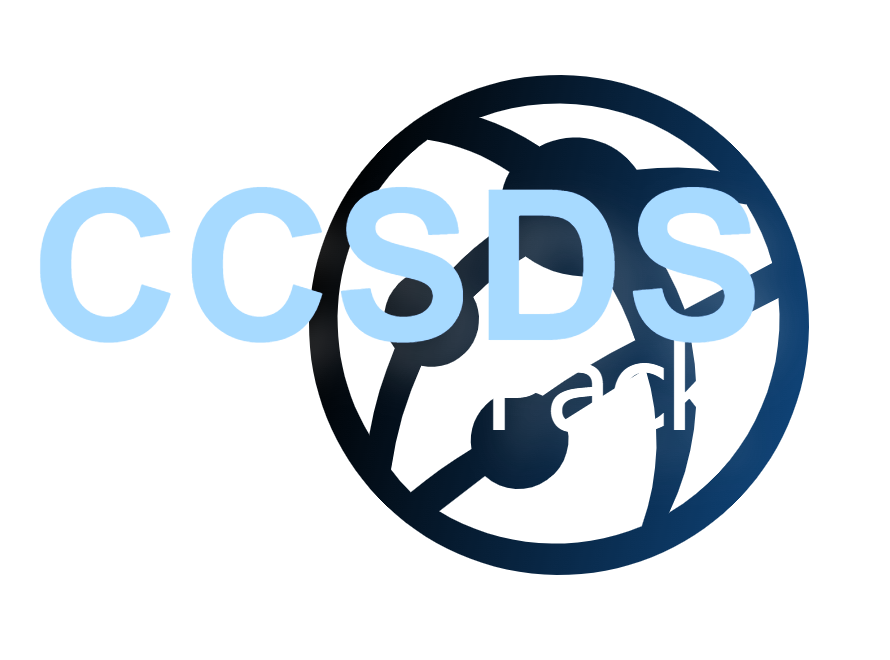
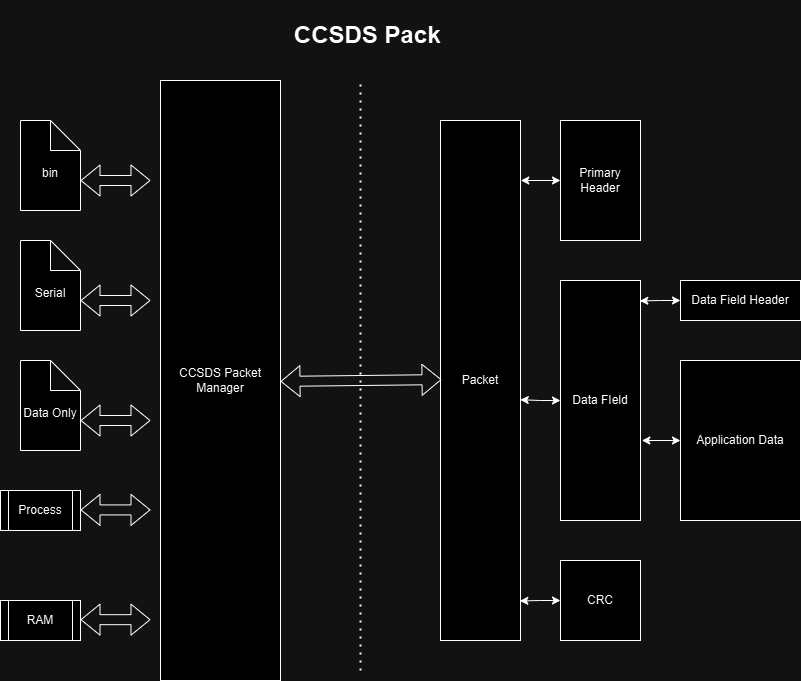
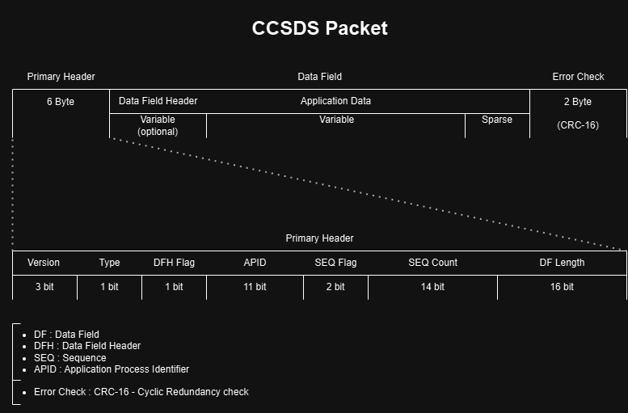
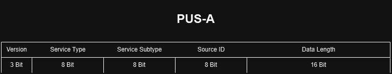
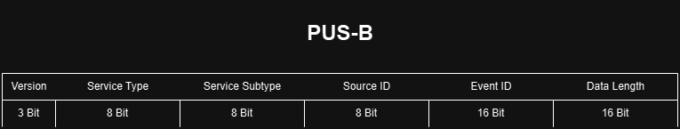
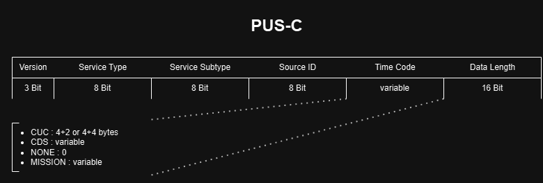

<div style="text-align: center;">
    
</div>

# CCSDSPack - [ExoSpaceLabs](https://github.com/ExoSpaceLabs)
**CCSDSPack** is a lightweight, high-performance C++ library for handling 
[CCSDS (Consultative Committee for Space Data Systems)](https://public.ccsds.org/) packets.
It provides utilities to create, parse, and manage CCSDS-compliant telemetry (TM) and 
telecommand (TC) packets with a modern C++ design and customizable serialization.


## Table of Contents
- [Status](#status)
- [Features](#features)
- [Documentation](#documentation)
- [Install](#install)
    - [Source](#source)
        - [Linux](#linux)
        - [Windows](#windows)
    - [Package](#package)
    - [Docker](#docker)
- [Examples](#examples)

---
## Status
The following tables show the current overall build and regression test status of the library.

| Linux | Windows |
|-------|---------|
 | |  | 

Specific distribution build and regression status are shown below

| OS      | Distribution  |  status |
|---------|---------------|--------------|
| Linux   | ubuntu-22.04  |      |
|         | ubuntu-24.04  |     |
|         | ubuntu-latest |       |
|         | latest        |       |
---

## Features

- Support for both **TM** and **TC** CCSDS packets using integrated PUS standards
- Custom serialization with support for `std::vector`, `std::shared_ptr`, and user-defined types
- End-to-end encoding / decoding and validation 
- Easy to test and integrate
- Built-in extensibility for secondary headers with clear abstraction
- User-friendly installation and usage within your code.
- Example Executables (encoder, decoder and validator) see [Executables](docs/EXECUTABLES.md) 
- Optimised for fast execution.
- Pre-built .deb package downloadable from [Releases](https://github.com/ExoSpaceLabs/CCSDSPack/releases).
- Pre-built docker image with library installed, see [docker](#docker).
- Exceptionless library, variant based error management enabling the usage within embedded systems see [Error management](docs/ERROR.md).
- Baremetal build for targeted devices see [Cross-Build Guide](docs/CROSSBUILD.md).
---
## Documentation
Full API documentation is available and hosted here:  [CCSDSPack Documentation](https://exospacelabs.github.io/CCSDSPack/html/)


C++ Library for CCSDS Space Packet manipulation. i.e. generation, extraction, analysis and more



### Manager
Features Provided by the CCSDS::Manager class(Assuming the Packet identifier data is known):

* Generate CCSDS packets with desired data (Segmented and Unsegmented).
* Validate Packets coherence / against template (packet with set identifier).
* Update Error Control and data specific parameters (CRC16, Counters, Flags Length...).
* Include / remove / change Sync Pattern.
* Read / Write a binary file and extract CCSDS packets.

### The CCSDS packet protocol



- **Primary Header** — Fixed size, always present. Defines APID, packet type, data length, and other control flags.
- **Secondary Header** — Optional; type depends on the mission and protocol standards used (e.g., PUS-A/B/C).
- **Application Data** — Mission-specific payload bytes.
- **Error Control Field (optional)** — CRC or checksum for integrity verification.

---

### PUS Standards in CCSDSPack

The **Packet Utilization Standard (PUS)** defines conventions for structuring the Secondary Header and Application Data in CCSDS packets for ESA missions.  
CCSDSPack includes **built-in support** for several PUS standards out of the box:

---

#### **PUS-A Telecommand (TC)**

A fixed-size secondary header format used in **Telecommand (TC)** packets.



- **Purpose:** Command packets sent from ground to spacecraft.
- **Secondary Header size:** Fixed (typically 4–6 bytes depending on implementation).
- **Common fields:** Service type, service subtype, source ID.
- **Advantages:** Simple, low overhead, deterministic parsing.

---

#### **PUS-B Telemetry (TM)**

A fixed-size secondary header format used in **Telemetry (TM)** packets.



- **Purpose:** Data packets sent from spacecraft to ground.
- **Secondary Header size:** Fixed (typically 6–8 bytes).
- **Common fields:** PUS version, service type/subtype, time information, source ID, optional event ID.
- **Advantages:** Standardized time coding, predictable layout, widely supported in ESA ground systems.

---

#### **PUS-C** (Flexible / Variable)

A more flexible and **variable-sized** secondary header format.



- **Purpose:** Allows missions to define a custom secondary header layout while still remaining PUS-compliant.
- **Secondary Header size:** Variable (defined by mission config).
- **Common use:** Missions requiring extended metadata, non-standard time formats, or extra identification fields.
- **Advantages:** Flexibility for evolving mission requirements; still compatible with CCSDS framing.

---
### Other Documents
Please check out the documentation on [ccsds documentation](https://public.ccsds.org/Publications/default.aspx). Recommended documents are within the Blue and Green
books.

Also take a look of the following documents:

* [CCSDS 133.0-B-2](https://public.ccsds.org/Pubs/133x0b2e2.pdf) - Space Packet Protocol
* [CCSDS 133.1-B-3](https://public.ccsds.org/Pubs/133x1b3e1.pdf) - Encapsulation Packet Protocol
* [CCSDS 524.1-B-1](https://public.ccsds.org/Pubs/524x1b1.pdf) - Mission Operations--MAL Space Packet Transport Binding and Binary Encoding

---

## Install
1) Source  - use the cmake and make commands to compile the whole project and install it.
2) Package - Install using prebuilt .deb package from [Releases](https://github.com/ExoSpaceLabs/CCSDSPack/releases). Further info on [Packages](docs/PACKAGES.md).
3) Docker  - Docker image available from github hosted repo [Container](https://github.com/ExoSpaceLabs/CCSDSPack/pkgs/container/ccsdspack), also see [docker](#docker) section.

### Source
CMake flags:

The following flags can be provided to cmake when building the project to enable disable build of 
specific provided features. such as tester, which may or may not be of interest. 

| Cmake Flag (default value) | Description                                                                  |
|----------------------------|------------------------------------------------------------------------------|
| -DCCSDSPACK_BUILD_MCU=OFF  | build the project as a static library for microcontrollers. *                |
| -DENABLE_TESTER=ON         | build tester, that performs regression tests of the library.                 | 
| -DENABLE_ENCODER=ON        | build encoder executable that encodes a file using ccsds packets             |
| -DENABLE_DECODER=ON        | build decoder executable that decodes a binary file containing ccsds packets |
| -DENABLE_VALIDATOR=ON      | build validator executable that validates packets.                           |

*Used when compiling library for baremetal, refer to the [Cross-Build Guide](docs/CROSSBUILD.md) for usage.

see executable enabler example usage during cmake setup below.

---

#### Linux

Install dependencies (GCC ≥ 8.5.0, CMake ≥ 3.20,  C++17 or newer)
```bash

sudo apt update
sudo apt install -y cmake make g++ 
```
Clone Repo:
```bash

git clone https://github.com/ExoSpaceLabs/CCSDSPack.git
cd CCSDSPack
```

set up cmake and build
```bash

cd build && cmake .. && make
#cmake .. -DBUILD_TESTER=OFF
```
Assuming build has been successful the tester can be run from the build directory. So if
you are still within the build dir just run the following commands:
```bash

cd ../bin && ./CCSDSPack_tester 
```
The library is advised to be installed using the following commands under /usr/local
```bash

make install
```
Note: this might require privileged `sudo` command as per permission restrictions.

---
#### Windows
tested on Windows-2019 and Windows-latest (see git hub [Actions](https://github.com/ExoSpaceLabs/CCSDSPack/actions/workflows/windows.yml))

Install dependencies:

```shell

choco install cmake --installargs 'ADD_CMAKE_TO_PATH=System' -y
choco install ninja -y
choco install mingw -y
```

Configure CMake and build using MinGW (Assuming the repo has been cloned)
```shell

cd build
cmake -G "MinGW Makefiles" ..
cmake --build . -- 
```
The tester can already be executed using the following commands:
```shell

cd build/bin && ./CCSDSPack_tester.exe
```
Note: Cmake will deploy test files to bin directory, if the tester is not executed from the
bin directory some tests will fail.

---

### Package
Pre-built package releases can be downloaded from [Releases](https://github.com/ExoSpaceLabs/CCSDSPack/releases).
However, it is recommended to use the [latest-release](https://github.com/ExoSpaceLabs/CCSDSPack/releases/latest).

```bash

curl -LO https://github.com/ExoSpaceLabs/CCSDSPack/releases/download/v<version>/ccsdspack-v<version>-<system>-<architecture>.deb
sudo dpkg -i ccsdspack-v<version>-<system>-<architecture>.deb
```

If the required system is not prebuilt or available on the above list, it can be generated by
following instructions in [Packages](docs/PACKAGES.md) document. Where detailed information 
is provided for library inclusion in private projects.

### Docker
Prebuilt Docker images of CCSDSPack are published on [GHCR](https://github.com/ExoSpaceLabs/CCSDSPack/pkgs/container/ccsdspack).  
They provide a ready-to-use environment with the library and command-line tools already installed, 
so you don’t need to compile from source or manage dependencies manually (almost none in this case).

Pull a specific release image:
```bash

 docker pull ghcr.io/exospacelabs/ccsdspack:v<version>
```
**Example usage:**

Pull version 1.1.0 of the container
```bash

docker pull ghcr.io/exospacelabs/ccsdspack:v1.1.0
```

Test the library by run the `CCSDSPack_tester` executable as follows.
```bash

docker run ghcr.io/exospacelabs/ccsdspack:v1.1.0 /usr/bin/CCSDSPack_tester
```
The container includes the executables:

- `ccsds_encoder`
- `ccsds_decoder`
- `ccsds_validator`
- `CCSDSPack_tester`

With a mounted volume, you can encode, decode, and validate packets against files on your host.
For exploratory use, start an interactive shell inside the container:
```bash

docker run -it --rm ghcr.io/exospacelabs/ccsdspack:v1.0.0 /bin/bash
```

___
## Examples

> ***NOTE: Do not confuse with CFDP, it simply encode and decodes data into the application field.***
> ***Future release, might include CFDP Protocol utilization.***

### Encoder:

Encode a specific file into the application data of CCSDS packets and save streamed packets 
data to a desired file.

requirements: 
* a file to encode
* configuration file which holds the template packet data and settings

```bash

ccsds_encoder -i <file_to_encode> -o <encoded_binaryFile> -c <config_file>
```
### Decoder:

Decode a previously encoded binary file holding serialized CCSDS packets, extract application 
data and recreate original file. 

requirements:
* an encoded binary file 
* configuration file used to encode the packets holding template packet data and settings

```bash

ccsds_decoder -i <encoded_binaryFile> -o <decoded_file> -c <config_file>
```

Note: If the decoded file is named with the original file extension it will be usable as the original file,

For more detailed info and other examples (e.g. Validator usage) see [Executables](docs/EXECUTABLES.md).

The configuration file description and usage can be found under [Config file](docs/CONFIG.md). 

### C++
The following examples show how the high level C++ APIs can be used in a project

Note: Assume a Big endian logic for data processing.
1) This example shows how this library can be used to generate a ccsds packet or stream of packets using CCSDSPack

```c++
#include "CCSDSPack.h"

int main(){

  std::vector<std::uint8_t> inputBytes; // assume data is present
  // make a packet and set header to be used as template  
  CCSDS::Packet templatePacket;
  if(const auto res = templatePacket.setPrimaryHeader(0xF7FF4FFFFFFF); !res.has_value()){
    std::cerr << res.error().message() << std::endl;
    return res.error().code();
  }

  // set template packet in manager
  CCSDS::Manager manager(templatePacket);
  manager.setDatFieldSize(1024); // sets max datafield size
  
  // load data
  if (const auto res = manager.setApplicationData(inputBytes); !res.has_value()) {
    std::cerr <<  res.error().message() << std::endl;
    return res.error().code();
  }
  std::vector<CCSDS::Packet> packets = manager.getPackets();
  // to manipulate as required.
  
  return 0;
}
```
Where the 'inputBytes' are a set of bytes that are to be set as application into the packets. This is performed by 
first setting a template packet in the manager. Which then will be used as reference for all packets generated. and the 
application data is then set using the setApplicationData manager member method. This generates CCSDS packets in  the 
manager. It can be retrieved by using the getPackets method. and further manipulation can be performed if required.

2) Assuming you already have a CCSDS packet stream and want to extract the data from it.

```c++
#include "CCSDSPack.h"

int main(){

  std::vector<CCSDS::Packet> packets; // assume data is present

  // set template packet in manager
  CCSDS::Manager manager;
  manager.setDatFieldSize(1024); // sets max datafield size
  
  // load data
  if (const auto res = manager.load(packets); !res.has_value()) {
    std::cerr <<  res.error().message() << std::endl;
    return res.error().code();
  }
  // get the data buffer of the packets.
  std::vector<std::uint8_t> data = manager.getApplicationDataBuffer();
  return 0;
}
```
Assuming we have a vector of CCSDS packets prepared ad hoc. These packets then can be loaded by the manager.
If required the manager allows the packets to be validated for coherence, or if the template is set against it.
In the example above the application data is retrieved from all packets into a single stream of data.

for more examples see [Examples](docs/EXAMPLES.md).

