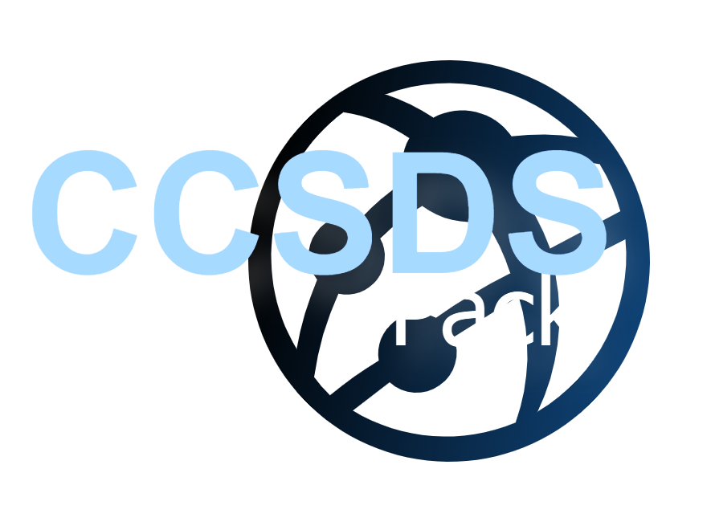

<!--
Copyright 2025-2026 ExoSpaceLabs
SPDX-License-Identifier: Apache-2.0
-->

<div style="text-align: center;">
    
</div>

# CCSDSPack [[ExoSpaceLabs](https://github.com/ExoSpaceLabs)]

**CCSDSPack** is a C++17 library for creating, parsing, managing, and validating CCSDS Space Packet protocol data units.

The v1.2 packet layer targets **CCSDS 133.0-B-2, Issue 2, including Editorial Change 2 (September 2024)** through a documented Space Packet PDU profile.

> [!IMPORTANT]
> The v1.2 conformity claim is limited to the **Space Packet PDU profile**. CCSDSPack does not implement the complete abstract Packet Service, Octet String Service, all protocol procedures, or a Protocol Implementation Conformance Statement.

> [!IMPORTANT]
> The bundled `PusA`, `PusB`, and `PusC` classes are legacy project-specific secondary-header formats. They are not official ECSS Packet Utilisation Standard implementations.

## Status

| Linux | Windows |
|---|---|
|  |  |

| Platform | CI |
|---|---|
| Ubuntu 22.04 |  |
| Ubuntu 24.04 |  |
| Ubuntu latest |  |
| Windows latest |  |

## Protocol profile

A serialized Space Packet contains:

```text
6-octet Packet Primary Header
+ Packet Data Field
```

The Packet Data Field contains optional secondary-header bytes followed by mission application data. When the CCSDSPack CRC16 profile is enabled, its final two octets are reserved for the CRC trailer:

```text
Packet Data Field = optional secondary header
                  + application data
                  + optional CCSDSPack CRC16 trailer
```

The CRC trailer is a **CCSDSPack mission-profile convention inside the Packet Data Field**. CCSDS 133.0-B-2 does not define it as a third Space Packet structural field.

Detailed scope, limitations, and migration behavior are documented in [CCSDS 133.0-B-2 EC2 Space Packet PDU profile](docs/CCSDS_133_0_B_2_PROFILE.md).

### Primary-header rules

CCSDSPack v1.2 enforces the following Packet-level rules:

- Packet Version Number is `000`;
- telemetry and telecommand Packet Types are supported;
- the complete 11-bit APID range is supported;
- APID `0x7FF` is reserved for Idle Packets;
- Idle Packets have no secondary header and contain mission-defined idle user data;
- Packet Data Length is the number of octets after the primary header minus one;
- Sequence Flags use the CCSDS first, continuation, last, and unsegmented values;
- Packet Sequence Count advances modulo 16384 in automatic Manager mode.

CCSDSPack uses Packet Sequence Count semantics for both telemetry and telecommand packets. The optional telecommand Packet Name interpretation is not implemented.

### Packet size

The Packet Data Field can contain 1 through 65,536 octets, giving a total serialized packet size of 7 through 65,542 octets.

Use:

```cpp
std::size_t packetSize = packet.getSerializedSize();
```

for the complete range. The legacy `getFullPacketLength()` API returns `std::uint16_t` and saturates at `UINT16_MAX` rather than wrapping.

### Packet error control

`PacketErrorControlMode` supports:

- `PacketErrorControlMode::CRC16`, the existing v1 default;
- `PacketErrorControlMode::None`.

In CRC16 mode, CCSDSPack reserves the final two Packet Data Field octets for CRC-16/CCITT-FALSE and includes those octets in Packet Data Length. The receiver must configure the expected mode before parsing.

## Features

- CCSDS 133.0-B-2 EC2 Space Packet PDU construction and parsing;
- exact bounded parsing with consumed-byte reporting;
- concatenated packet-stream handling;
- optional project-specific CRC16 trailer;
- complete 11-bit APID handling and Idle Packet validation;
- modulo-16384 sequence counting and segmentation utilities;
- one complete Packet Identification binding per Manager;
- custom and opaque secondary-header support;
- exception-free `Result` and `Error` handling;
- Linux and Windows builds;
- optional bare-metal and cross-build targets;
- encoder, decoder, validator, and regression-test executables;
- installed CMake package and shared-library consumer test.

## Documentation

- [Generated API reference](https://exospacelabs.github.io/CCSDSPack/html/)
- [CCSDS 133.0-B-2 EC2 PDU profile](docs/CCSDS_133_0_B_2_PROFILE.md)
- [v1.2 current behavior](docs/V1_2_CURRENT_BEHAVIOUR.md)
- [CLI reference](docs/CLI.md)
- [Configuration reference](docs/CONFIG.md)
- [Error handling](docs/ERROR.md)
- [Packages](docs/PACKAGES.md)
- [Cross-build guide](docs/CROSSBUILD.md)
- [Examples](docs/EXAMPLES.md)

## Build from source

Requirements:

- CMake 3.16 or newer;
- a C++17 compiler;
- GCC 8.5 or newer on supported Linux configurations.

```bash
git clone https://github.com/ExoSpaceLabs/CCSDSPack.git
cd CCSDSPack
cmake -S . -B build
cmake --build build
```

Run the regression tester from the configured binary directory:

```bash
./bin/CCSDSPack_tester
```

Install the library and exported CMake package:

```bash
cmake --install build
```

### Build options

| CMake option | Default | Description |
|---|---:|---|
| `CCSDSPACK_BUILD_MCU` | `OFF` | Build the MCU static-library profile |
| `ENABLE_TESTER` | `ON` | Build `CCSDSPack_tester` |
| `ENABLE_ENCODER` | `ON` | Build `ccsds_encoder` |
| `ENABLE_DECODER` | `ON` | Build `ccsds_decoder` |
| `ENABLE_VALIDATOR` | `ON` | Build `ccsds_validator` |

### Windows with MinGW

```powershell
cmake -S . -B build -G "MinGW Makefiles"
cmake --build build
```

The Windows workflow copies the shared-library DLL beside the test and external-consumer executables before running them.

## CMake integration

After installing CCSDSPack:

```cmake
find_package(CCSDSPack CONFIG REQUIRED)

add_executable(my_app main.cpp)
target_link_libraries(my_app PRIVATE ccsdspack::CCSDSPack)
```

For a non-standard install prefix:

```bash
cmake -S . -B build -DCMAKE_PREFIX_PATH=/path/to/install/prefix
```

## C++ example

```cpp
#include <CCSDSPack.h>
#include <cstdint>
#include <vector>

int main() {
  CCSDS::Packet packetTemplate;
  const auto headerResult = packetTemplate.setPrimaryHeader(CCSDS::PrimaryHeader{
    0,                       // Packet Version Number 000
    0,                       // telemetry packet
    0,                       // no secondary header
    0x123,                   // APID
    CCSDS::UNSEGMENTED,
    0,
    0                        // calculated during serialization
  });
  if (!headerResult) return headerResult.error().code();

  packetTemplate.setDataFieldSize(1024);

  CCSDS::Manager manager;
  const auto templateResult = manager.setPacketTemplate(packetTemplate);
  if (!templateResult) return templateResult.error().code();

  const std::vector<std::uint8_t> inputBytes{0x10, 0x20, 0x30};
  const auto dataResult = manager.setApplicationData(inputBytes);
  if (!dataResult) return dataResult.error().code();

  const auto wire = manager.getPacketsBuffer();
  return wire.empty() ? 1 : 0;
}
```

## Command-line tools

The build can provide:

- `ccsds_encoder`;
- `ccsds_decoder`;
- `ccsds_validator`;
- `CCSDSPack_tester`.

The encoder, decoder, and validator support `crc16` and `none` packet-error-control profiles. See [CLI reference](docs/CLI.md) for exact options, concatenated decoding, trailing-byte handling, validation categories, and exit codes.

## Packages and container

Release packages are published under [GitHub Releases](https://github.com/ExoSpaceLabs/CCSDSPack/releases).

Container images are published at:

```bash
docker pull ghcr.io/exospacelabs/ccsdspack:<version>
```

The image contains the library and command-line executables. Run the installed tester with:

```bash
docker run --rm ghcr.io/exospacelabs/ccsdspack:<version> /usr/bin/CCSDSPack_tester
```

## Legacy secondary headers

The v1 API retains `PusA`, `PusB`, and `PusC` for compatibility with existing projects and configuration files. Their layouts are project-specific ancillary-data formats.

- `PusA` and `PusB` are fixed-size legacy formats;
- `PusC` contains a variable application-configured byte sequence described as a time-code field;
- none of these classes is claimed to implement an official ECSS PUS revision;
- `PusC` bytes are not automatically validated as a CCSDS time-code format.

Standards-oriented ECSS PUS support remains v2.0.0 scope.

## Compatibility with pre-v1.2 packets

The v1 public source API remains available, but corrected wire semantics may differ from packets produced by earlier releases. Changes include Packet Data Length, CRC coverage, parsing boundaries, sequence behavior, Packet Identification enforcement, version validation, and Idle Packet validation.

Stored or transmitted packets generated by older releases should be regenerated or migrated explicitly before adopting the v1.2 profile.

## License

CCSDSPack is licensed under the Apache License 2.0. See [LICENSE](LICENSE) and [Notice.md](Notice.md).
