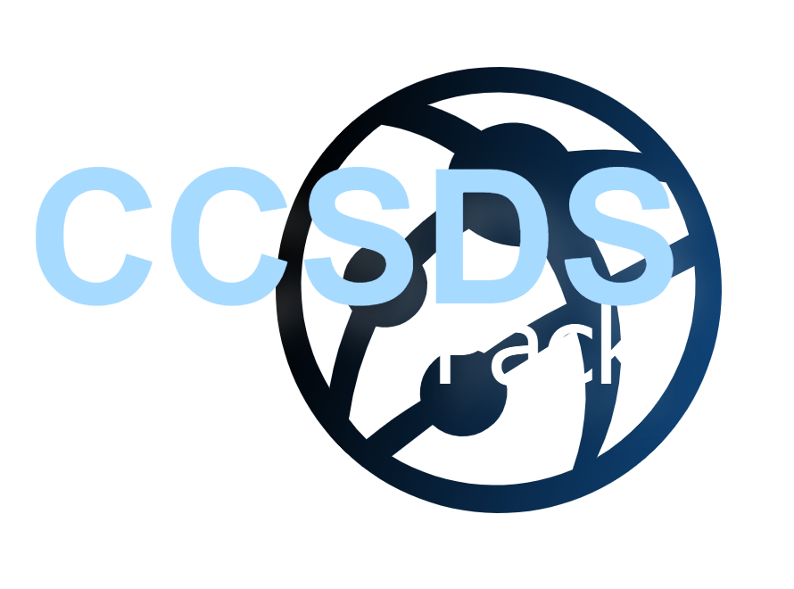
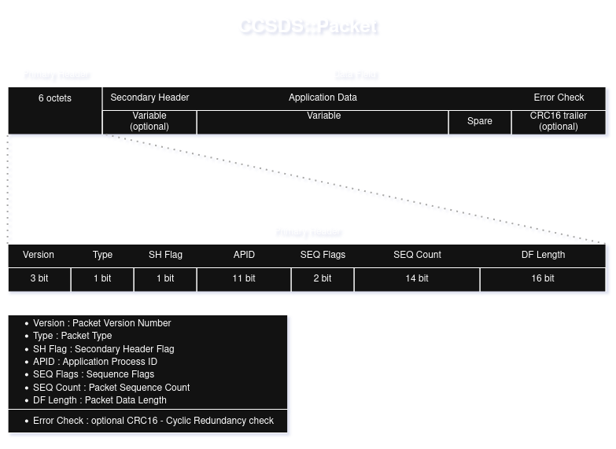
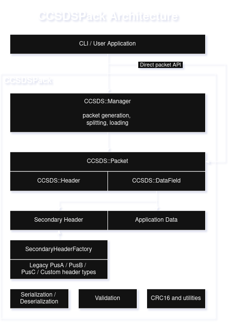

<!--
Copyright 2025-2026 ExoSpaceLabs
SPDX-License-Identifier: Apache-2.0
-->

<div style="text-align: center;">
    
</div>

# CCSDSPack [[ExoSpaceLabs](https://github.com/ExoSpaceLabs)]

**[API Documentation](https://exospacelabs.github.io/CCSDSPack/html/)** · [Documentation index](docs/README.md) · [Contributing](CONTRIBUTING.md)

**CCSDSPack** is a layered CCSDS Space Packet library with an authoritative **C11 protocol core** and a compatible **C++17 ownership/convenience API**. The C core provides allocation-free wire primitives, packet views, PUS codecs, CUC time, validation, segmentation/reassembly, and stream framing; the established C++ API remains available for owned `Packet`/`Manager` workflows.

The v2.1.0 implementation targets:

- **CCSDS 133.0-B-2, Issue 2, including Editorial Change 2** for the supported Space Packet PDU profile;
- **ECSS-E-70-41A** for supported PUS-A telecommand and telemetry secondary headers;
- **ECSS-E-ST-70-41C** for supported PUS-C telecommand and telemetry secondary headers;
- **CCSDS 301.0-B-4** for the supported basic numeric CUC time subset.

The implementation scope is intentionally packet-focused. Complete PUS services, transfer frames, COP-1, CFDP, routing, UTC/leap-second conversion, mission time correlation, and complete abstract CCSDS service interfaces are outside the library scope.

## Status

| Linux | Windows |
|---|---|
|  |  |

CI covers explicit Ubuntu 22.04, 24.04, and 26.04 runners, Windows latest, Doxygen, CLI integration, installed-package consumers, examples, and package/cross-build generation. Release-critical Linux jobs avoid the moving `ubuntu-latest` alias. UML generation is available manually and is not a release gate.

## Why CCSDSPack

CCSDSPack is designed around a few deliberately simple ownership rules:

- a `ccsds::Packet` owns one complete Space Packet and its packet-level policy;
- a concrete secondary-header object owns its own wire layout;
- PUS revision and TC/TM direction are intrinsic to the concrete PUS header type;
- packet error control is a Packet-level policy independent of PUS;
- a `ccsds::Manager` uses one complete Packet template as its stream contract;
- parsing is bounded and transactional, so failed input does not partially replace packet state;
- validation uses named checks rather than positional result fields;
- vector and pointer-plus-size APIs provide convenient application and transport-facing entry points.

This keeps configuration state localized and makes contradictory combinations difficult to express.

## Space Packet model

CCSDSPack implements the six-octet CCSDS primary header followed by a Packet Data Field. The Packet Data Field can contain an optional secondary header, application data, and, when enabled, the CCSDSPack packet-level CRC16 trailer.



The implementation enforces:

- Packet Version Number `000`;
- telemetry and telecommand Packet Types;
- the complete 11-bit APID range and Idle APID `0x7FF` structure;
- CCSDS Sequence Flags and modulo-16384 Packet Sequence Count handling;
- Packet Data Length equal to the number of octets following the primary header minus one;
- a Packet Data Field range of 1 to 65,536 octets and total packet size of 7 to 65,542 octets;
- consistency between directional secondary headers and the primary-header Packet Type.

`Packet::getSerializedSize()` returns the exact complete packet size as `std::size_t`. `getFullPacketLength()` remains available as a 16-bit view and saturates at `UINT16_MAX`.

## Packet error control

`ccsds::PacketErrorControlMode` is generic Packet policy:

```cpp
packet.setPacketErrorControlMode(ccsds::PacketErrorControlMode::CRC16);
// or
packet.setPacketErrorControlMode(ccsds::PacketErrorControlMode::None);
```

When CRC16 is enabled, the final two Packet Data Field octets contain CRC-16/CCITT-FALSE. Those octets contribute to Packet Data Length and are excluded from their own CRC calculation. The receiving side selects the expected mode before parsing.

## PUS secondary headers

Supported PUS identities are represented directly by concrete C++ types:

```text
ccsds::pus::rev_a::TcHeader  -> PUS-A Telecommand
ccsds::pus::rev_a::TmHeader  -> PUS-A Telemetry
ccsds::pus::rev_c::TcHeader  -> PUS-C Telecommand
ccsds::pus::rev_c::TmHeader  -> PUS-C Telemetry
```

Installing a directional header sets the CCSDS secondary-header flag and synchronizes Packet Type automatically.

```cpp
ccsds::Packet packet;
packet.setPrimaryHeader(ccsds::PrimaryHeader{
  0, 0, 0, 0x123, ccsds::UNSEGMENTED, 0, 0});

const auto result = packet.setSecondaryHeader(
  std::make_shared<ccsds::pus::rev_c::TcHeader>(
    17, 1, 0x1234, 0x09));
if (!result) return result.error().code();
```

PUS headers have standards-compatible default tailoring. Direction-specific tailoring types expose only optional layout choices such as PUS-A identifier widths, the PUS-A TM packet subcounter, spare octets, or an optional TM CUC timestamp. PUS-C TC source ID and TM destination ID are fixed at two octets by the supported layout.

Canonical runtime/configuration selectors are `PUS:revA:TC`, `PUS:revA:TM`, `PUS:revC:TC`, and `PUS:revC:TM`.

See [PUS tailoring](docs/MISSION_TAILORING.md).

## PUS parsing

A Packet can use a preinstalled secondary header as its parsing schema:

```cpp
ccsds::Packet packet;
packet.setSecondaryHeader(
  std::make_shared<ccsds::pus::rev_c::TmHeader>());
const auto parsed = packet.deserialize(wire);
```

or the typed convenience API:

```cpp
ccsds::Packet packet;
const auto parsed =
  packet.deserialize<ccsds::pus::rev_c::TmHeader>(wire);
```

Optional tailoring can be passed to the typed constructor path. The parser checks the primary-header Packet Type against the concrete header direction and commits decoded state only after the complete parse succeeds.

## Manager stream model

A `ccsds::Manager` represents one Packet Identification and one Packet Sequence Count stream. Its complete Packet template is the generation and receive contract, carrying Packet Identification, packet error control, secondary-header type, and any PUS tailoring.

```cpp
ccsds::Packet packetTemplate;
packetTemplate.setPrimaryHeader(ccsds::PrimaryHeader{
  0, 0, 0, 0x155, ccsds::UNSEGMENTED, 0, 0});
packetTemplate.setDataFieldSize(256);

ccsds::Manager manager;
manager.setPacketTemplate(packetTemplate);
manager.setApplicationData(payload, payloadSize);
```

Manager supports unsegmented and segmented packet generation, modulo-16384 sequence counting, transactional stream loading, application-data reassembly, and optional external synchronization-pattern framing.

Applications that manage multiple Packet Identification values use separate Manager instances or independent Packet objects.

## Structured validation

`ccsds::Validator` returns a fixed-capacity `ccsds::ValidationReport` with named `ValidationCode` entries:

```cpp
ccsds::Validator validator;
const auto report = validator.validate(packet);

if (report.failed(ccsds::ValidationCode::PacketDataLength)) {
  handleLengthFailure();
}
```

Checks cover generic packet structure, CRC16 when enabled, secondary-header presence/direction, segmentation and sequence continuity, Packet-template comparison, PUS revision/direction/tailoring, PUS field constraints, and CUC timestamp fit.

`ValidationReport` stores its checks in `std::array` and performs no dynamic allocation itself. The Validator is available in `CCSDS_MCU` builds and requires neither RTTI nor exceptions.

See [Structured validation](docs/VALIDATION.md).

## Raw transport buffers

CCSDSPack supports both `std::vector<std::uint8_t>` interfaces and pointer-plus-size transport interfaces.

A receiver can determine the complete packet size from the six-byte primary header:

```cpp
const auto packetSize = ccsds::buffer::declaredPacketSize(
  primaryHeader, sizeof(primaryHeader));
```

A complete buffer can then be parsed directly:

```cpp
const auto consumed = ccsds::buffer::deserializeBounded(
  packet, rxBuffer, receivedBytes);
```

Typed PUS raw parsing mirrors the vector API. In v2.1.0, raw bounded parsing is pointer-native and delegates packet framing/CRC validation to the C core without first copying the complete input into a bridge `std::vector`. Owned `Packet`/`Manager` state may still allocate where ownership requires it.

See [Raw-buffer APIs](docs/RAW_BUFFERS.md).

## Numeric CUC time

TM tailoring can enable basic numeric CUC timestamps with:

- CCSDS 1958 TAI or agency-defined epoch metadata;
- implicit or explicit basic one-octet P-field;
- 1 to 4 coarse octets;
- 0 to 3 fine octets;
- validated counter-width and P-field consistency.

CCSDSPack represents the numeric time code. Calendar conversion, leap-second handling, agency-epoch definition, and mission time correlation remain application responsibilities.

## Library architecture



The protocol layer is C11. The established C++17 Packet/Manager API is built above that core by default. Hosted builds export both layers; `CCSDSPACK_BUILD_MCU=ON` produces bare-metal static libraries while excluding host-only configuration and command-line components.

MCU builds can use `-fno-exceptions -fno-rtti`. The library as a whole is not described as heap-free; fixed-capacity/no-allocation claims apply specifically where documented, such as `ValidationReport`.

## Build and install

Requirements:

- CMake 3.16 or newer;
- a C11 compiler for the protocol core;
- a C++17 compiler only when `CCSDSPACK_BUILD_CPP=ON` (the default).

```bash
git clone https://github.com/ExoSpaceLabs/CCSDSPack.git
cd CCSDSPack
cmake -S . -B build -DCMAKE_BUILD_TYPE=Release
cmake --build build
cmake --install build
```

Installed consumers use the exported package:

```cmake
find_package(CCSDSPack 2.1 CONFIG REQUIRED)
target_link_libraries(my_app PRIVATE ccsdspack::CCSDSPack)
target_compile_features(my_app PRIVATE cxx_std_17)
```

Standalone `find_package()` examples are available under [`example/`](example/README.md).

Pure-C consumers can build or link only the C11 core:

```cmake
find_package(CCSDSPack 2.1 CONFIG REQUIRED)
target_link_libraries(my_c_app PRIVATE ccsdspack::c)
```

A C-only build does not require a C++ compiler:

```bash
CC=gcc CXX=/bin/false cmake -S . -B build-c \
  -DCCSDSPACK_BUILD_CPP=OFF \
  -DCCSDSPACK_BUILD_C_TESTS=ON
cmake --build build-c
```

The umbrella C header is `<ccsdspack/c/ccsdspack.h>`. Low-level C APIs use caller-owned buffers/views and do not hide heap ownership.

## Command-line tools

Hosted builds provide:

- `ccsds_encoder` for packet generation;
- `ccsds_decoder` for packet-stream decoding and application-data recovery;
- `ccsds_validator` for parser and structured validation diagnostics;
- `CCSDSPack_tester` for the native regression/conformance suite.

See [Command-line tools](docs/CLI.md).

## Documentation

- [Generated API documentation (Doxygen)](https://exospacelabs.github.io/CCSDSPack/html/)
- [Documentation index](docs/README.md)
- [Space Packet PDU profile](docs/CCSDS_133_0_B_2_PROFILE.md)
- [Compliance statement](COMPLIANCE.md)
- [Detailed CCSDS compliance matrix](CCSDS_COMPLIANCE.md)
- [PUS/CUC compliance baseline](docs/PUS_CUC_COMPLIANCE.md)
- [PUS tailoring](docs/MISSION_TAILORING.md)
- [Structured validation](docs/VALIDATION.md)
- [Configuration](docs/CONFIG.md)
- [Raw-buffer APIs](docs/RAW_BUFFERS.md)
- [Performance baseline](docs/PERFORMANCE.md)
- [Examples](docs/EXAMPLES.md)
- [Packages and cross-builds](docs/PACKAGES.md)
- [v1 to v2 migration](docs/MIGRATION_V1_TO_V2.md)

## License

CCSDSPack is licensed under the Apache License 2.0. See [LICENSE](LICENSE) and [Notice.md](Notice.md).
